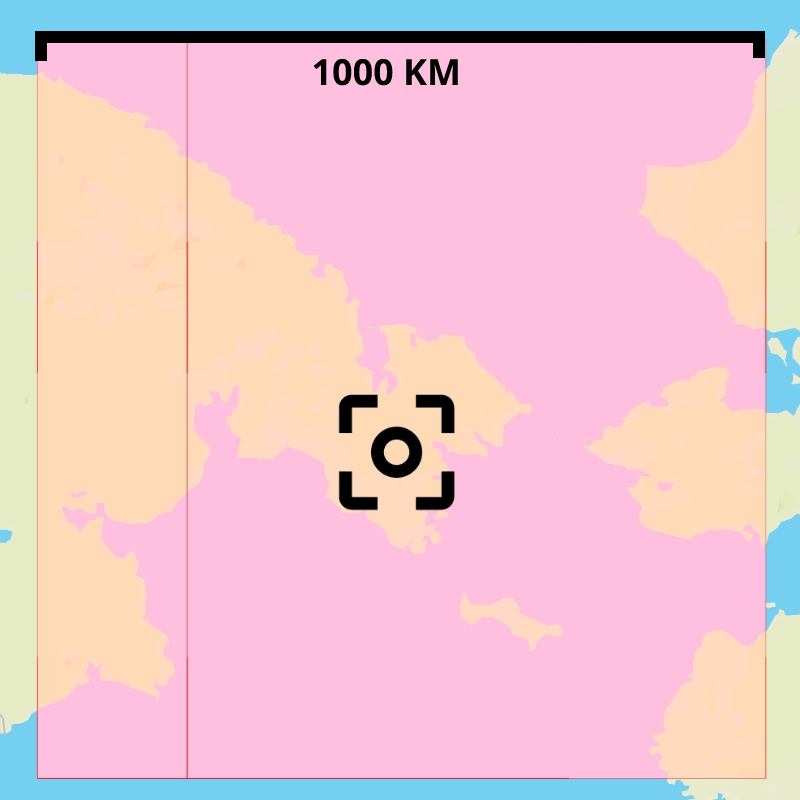

# Coords

A coordinates distance calculator.

## Installation

Requires Node.js

- Clone the repository `git clone https://github.com/MarkNjunge/coords.git`
- Run using `npm start`.

You can change the port using the `PORT` environment variable.

## Routes

### Distance between coordinates

Calculates the distance (in km) between two coordinates.

`/distance?lat1={latitude-1}&lng1={longitude-1}&lat2={latitude-2}&lng2={longitude-1}`  
e.g. http://localhost:3000/distance?lat1=-1.28333&lng1=36.81667&lat2=-4.036878&lng2=39.669571

**Response**

```Json
{
  "distance": 440.6177
}
```

### Bounding box

Returns a bounding box given distance and center point (coordinates). The result will have width of `2 _ inradius_.

`/bounds?lat={latitude}&lng={longitude}&inradius={inradius}`  
e.g. http://localhost:3000/bounds?lat=-1.286557&lng=36.817374&inradius=50

**Response**

```Json
{
  "extremes": {
    "lat": {
      "max": -0.8361,
      "min": -1.7371
    },
    "lng": {
      "max": 37.2672,
      "min": 36.3676
    }
  },
  "bounds": {
    "topRight": {
      "lat": -0.8361,
      "lng": 37.2672
    },
    "bottomRight": {
      "lat": -1.7371,
      "lng": 37.2672
    },
    "bottomLeft": {
      "lat": -1.7371,
      "lng": 36.3676
    },
    "topLeft": {
      "lat": -0.8361,
      "lng": 36.3676
    }
  }
}
```

<h1 align="center">
	
</h1>

#### Wrapping

A wrap paremeter an also be added to the request to support requests near the [antimeridian](https://en.wikipedia.org/wiki/180th_meridian).

It will split the bouding box into two seperate boxes. _See image below_

`/bounds?lat={latitude}&lng={longitude}&inradius={inradius}&wrap={wrap}`  
e.g. http://localhost:3000/bounds?lat=65.601221&lng=-173.766828&inradius=500&wrap=true

**Response**

```Json
[
  {
    "extremes": {
      "lat": {
        "max": 70.1057,
        "min": 61.0967
      },
      "lng": {
        "max": 180,
        "min": 175.3478
      }
    },
    "bounds": {
      "topRight": {
        "lat": 70.1057,
        "lng": 180
      },
      "bottomRight": {
        "lat": 61.0967,
        "lng": 180
      },
      "bottomLeft": {
        "lat": 61.0967,
        "lng": 175.3478
      },
      "topLeft": {
        "lat": 70.1057,
        "lng": 175.3478
      }
    }
  },
  {
    "extremes": {
      "lat": {
        "max": 70.1057,
        "min": 61.0967
      },
      "lng": {
        "max": -162.8814,
        "min": -180
      }
    },
    "bounds": {
      "topRight": {
        "lat": 70.1057,
        "lng": -162.8814
      },
      "bottomRight": {
        "lat": 61.0967,
        "lng": -162.8814
      },
      "bottomLeft": {
        "lat": 61.0967,
        "lng": -180
      },
      "topLeft": {
        "lat": 70.1057,
        "lng": -180
      }
    }
  }
]
```

<h1 align="center">
	
</h1>
